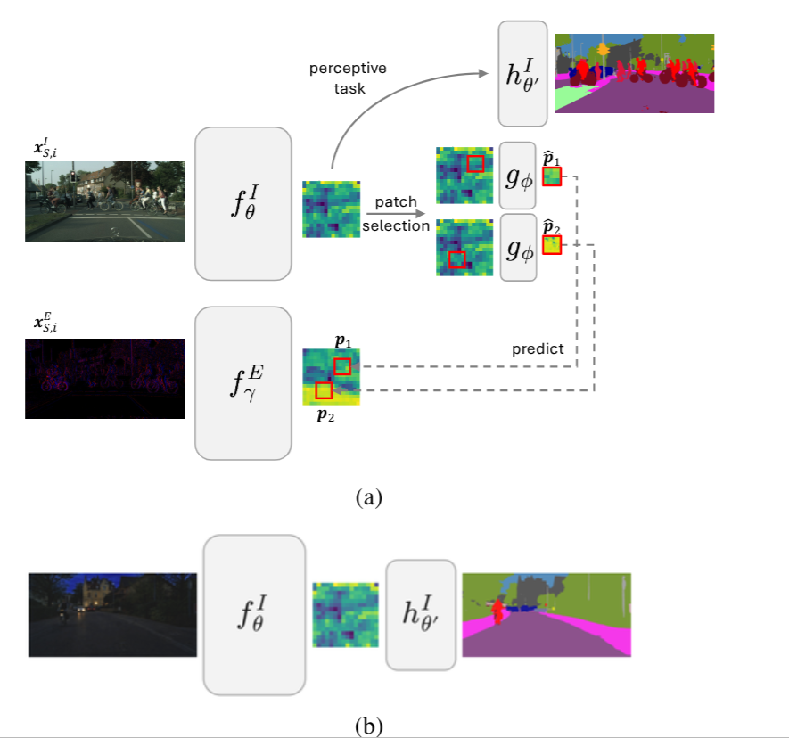
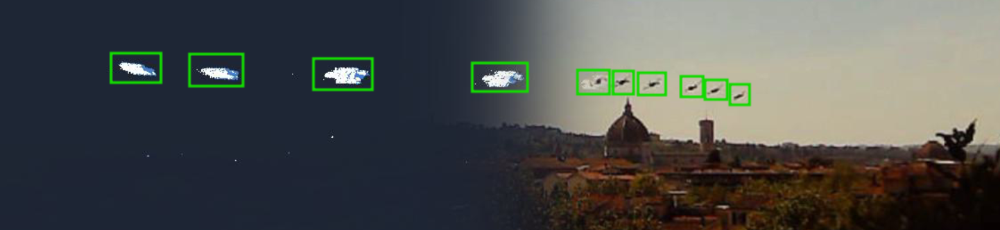
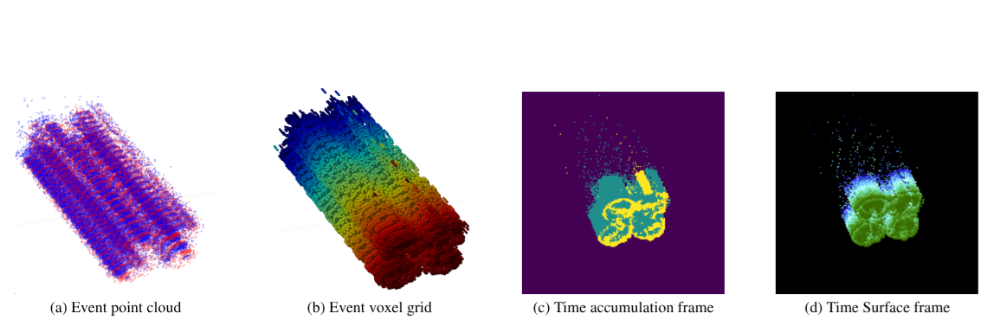
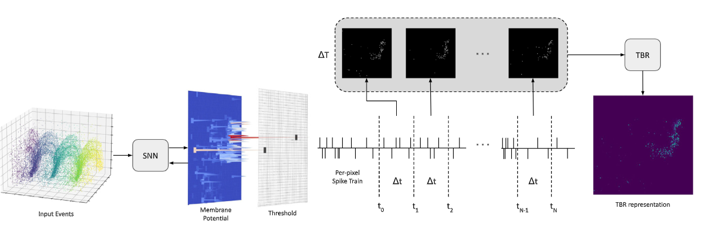
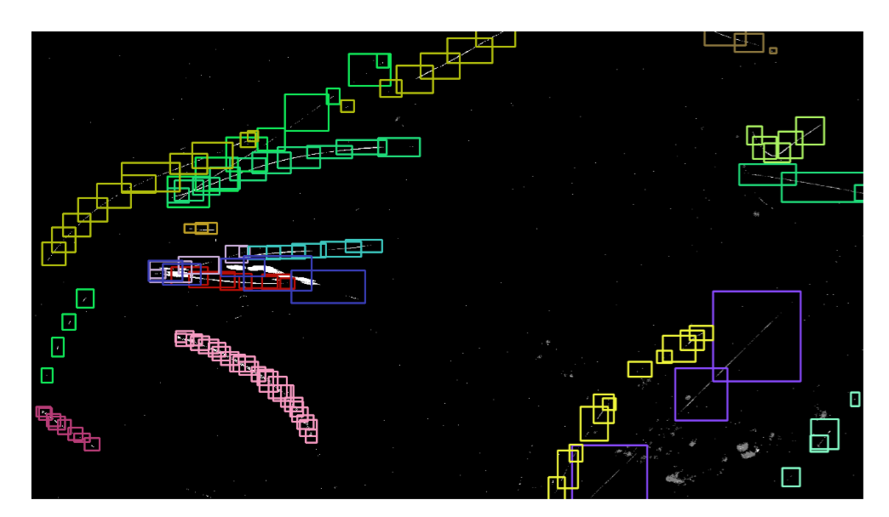
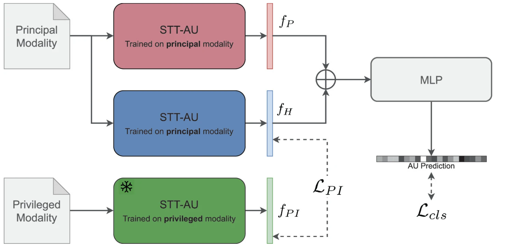
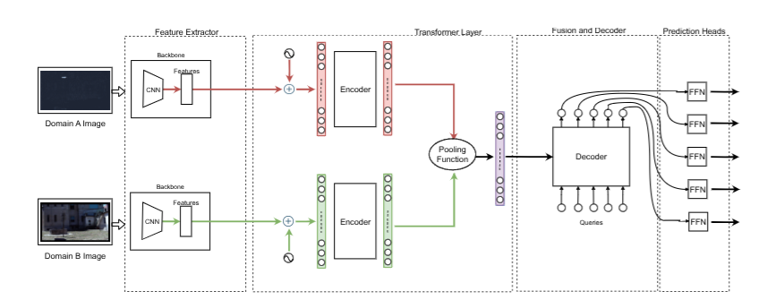

# Publications

## 2026

    

        
    

    

        <h3 class="publication-title">
            <a href="https://arxiv.org/abs/2602.04583" class="publication-link">
                PEPR: Privileged Event-based Predictive Regularization for Domain Generalization
            </a>
        </h3>
        
CVPR 2026 Findings Track

        
G Magrini, F Becattini, N Biondi, P Pala

        
2026

        

             Domain Generalization
             Event Camera
            <a href="https://arxiv.org/abs/2602.04583" class="tag tag-arxiv">ARXIV</a>
            <a href="https://github.com/miccunifi/PEPR" class="tag tag-github">GITHUB</a>
        

    

## 2025

    

        
    

    

        <h3 class="publication-title">
            <a href="https://dl.acm.org/doi/abs/10.1145/3746027.3758271" class="publication-link">
                Fred: The florence rgb-event drone dataset
            </a>
        </h3>
        
ACM MM 2025 Main Conference

        
G Magrini, N Marini, F Becattini, L Berlincioni, N Biondi, P Pala, AD Bimbo 

        
2025

        

             Drone Detection
             Event Camera
            <a href="https://dl.acm.org/doi/abs/10.1145/3746027.3758271" class="tag tag-arxiv">ACM Library</a>
            <a href="https://https://github.com/miccunifi/FRED" class="tag tag-github">GITHUB</a>
        

    

    

        
    

    

        <h3 class="publication-title">
            <a href="https://openaccess.thecvf.com/content/ICCV2025W/NeVi/html/Magrini_Drone_Detection_with_Event_Cameras_ICCVW_2025_paper.html0" class="publication-link">
                Drone Detection with Event Cameras
            </a>
        </h3>
        
ICCV 2025 NeVi Workshop

        
G Magrini, L Berlincioni, F Becattini, L Cultrera, P Pala 

        
2025

        

             Survey
             Drone Detection
             Event Camera
            <a href="https://openaccess.thecvf.com/content/ICCV2025W/NeVi/html/Magrini_Drone_Detection_with_Event_Cameras_ICCVW_2025_paper.html" class="tag tag-arxiv">Open Access</a>
        

    

    

        
    

    

        <h3 class="publication-title">
            <a href="https://www.sciencedirect.com/science/article/pii/S0167865525002144" class="publication-link">
                Spike-TBR: A noise resilient neuromorphic event representation
            </a>
        </h3>
        
Pattern Recognition Letters

        
G Magrini, F Becattini, L Cultrera, L Berlincioni, P Pala, A Del Bimbo 

        
2025

        

             Spiking Neural Network
             Event Camera
            <a href="https://www.sciencedirect.com/science/article/pii/S0167865525002144" class="tag tag-arxiv">SCIENCE DIRECT</a>
        

    

    

        
    

    

        <h3 class="publication-title">
            <a href="https://openaccess.thecvf.com/content/CVPR2025W/EventVision/html/Magrini_EV-Flying_an_Event-based_Dataset_for_In-The-Wild_Recognition_of_Flying_Objects_CVPRW_2025_paper.html" class="publication-link">
                EV-flying: An event-based dataset for in-the-wild recognition of flying objects
            </a>
        </h3>
        
CVPR 2025 Workshop

        
G Magrini, F Becattini, G Colombo, P Pala 

        
2025

        

             Drone Detection
             Flying Objects analysis
             Event Camera
            <a href="https://openaccess.thecvf.com/content/CVPR2025W/EventVision/html/Magrini_EV-Flying_an_Event-based_Dataset_for_In-The-Wild_Recognition_of_Flying_Objects_CVPRW_2025_paper.html" class="tag tag-arxiv">Open Access</a>
            <a href="https://github.com/MagriniGabriele/Ev-Flying" class="tag tag-github">GITHUB</a>
        

    

## 2024

    

        
    

    

        <h3 class="publication-title">
            <a href="https://link.springer.com/chapter/10.1007/978-3-031-87660-8_30" class="publication-link">
                Feature Hallucination via Privileged Information for Neuromorphic Face Analysis
            </a>
        </h3>
        
ICPR 2024 Workshop

        
L Berlincioni, L Cultrera, G Magrini, F Becattini, P Pala, A Del Bimbo 

        
2024

        

             Face Analysis
             Event Camera
            <a href="https://link.springer.com/chapter/10.1007/978-3-031-87660-8_30" class="tag tag-arxiv">SPRINGER</a>
        

    

    

        
    

    

        <h3 class="publication-title">
            <a href="https://link.springer.com/chapter/10.1007/978-3-031-92460-6_16" class="publication-link">
                Neuromorphic Drone Detection: An Event-RGB Multimodal Approach
            </a>
        </h3>
        
ECCV 2024 NeVi Workshop

        
G Magrini, F Becattini, P Pala, A Del Bimbo, A Porta 

        
2026

        

             Drone Detection
             Event Camera
            <a href="https://link.springer.com/chapter/10.1007/978-3-031-92460-6_16" class="tag tag-arxiv">SPRINGER</a>
            <a href="https://github.com/MagriniGabriele/NeRDD" class="tag tag-github">GITHUB</a>
        

    

